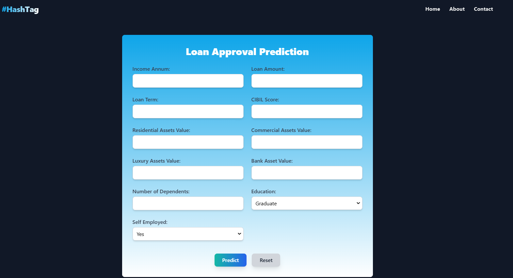

---

# Loan Approval Predictor

This project aims to predict whether a loan application will be approved based on various applicant details. The machine learning models are trained using data on past loan applications, including features like income, loan amount, credit score, and other personal information.

## Table of Contents

1. [Project Description](#project-description)
2. [Data Preprocessing](#data-preprocessing)
3. [Model Training](#model-training)
4. [API for Prediction](#api-for-prediction)
5. [Front-end](#front-end)
6. [How to Run Locally](#how-to-run-locally)
7. [Technologies Used](#technologies-used)
8. [License](#license)

## Project Description

The **Loan Approval Predictor** project uses machine learning models to classify loan applications as approved or rejected based on various input features. The project follows these main steps:
- **Data Preprocessing**: Clean and transform raw data into a format suitable for machine learning models.
- **Model Training**: Train multiple machine learning algorithms and select the best-performing model.
- **Loan Prediction API**: Provide an interface to make loan approval predictions based on new data.

### Key Features:
- **Data Preprocessing**: Data cleaning, feature engineering, and transformation (including scaling and encoding of categorical variables).
- **Model Training**: Training various classification algorithms (Logistic Regression, Decision Trees, Random Forest, XGBoost, etc.).
- **API**: A Flask-based web service that can predict loan approval based on user input.

## Data Preprocessing

Data preprocessing is crucial to prepare the raw data for machine learning models. The following steps are performed:
1. **Removing Negative Values**: All rows with negative residential asset values are removed.
2. **Feature Engineering**: A new feature, `total_asset_value`, is created by summing various asset categories.
3. **Dropping Unnecessary Columns**: Columns like `loan_id` and specific asset values are dropped as they are not useful for prediction.
4. **Label Encoding**: Categorical columns such as `education`, `self_employed`, and `loan_status` are label-encoded into numeric values.
5. **Feature Scaling**: Numerical columns like `income`, `loan amount`, etc., are scaled using StandardScaler to bring them to a similar range.
6. **Train-Test Split**: The data is split into training and testing datasets to evaluate model performance.

## Model Training

The following machine learning algorithms are trained and evaluated:
- **Logistic Regression**
- **Decision Tree Classifier**
- **Random Forest Classifier**
- **Gradient Boosting Classifier**
- **Support Vector Machine (SVM)**
- **K-Nearest Neighbors (KNN)**
- **Naive Bayes**
- **XGBoost Classifier**

The performance of each model is evaluated based on accuracy, precision, recall, and F1-score. The model with the highest accuracy is selected for deployment.

## API for Prediction

This project includes a Flask-based API for making loan approval predictions. The API allows users to input various loan application details (such as income, loan amount, and credit score) and get a prediction on whether the loan will be approved or not.

### Key API Endpoints:
- **`/`**: Displays the home page with a form to input loan application details.
- **`/predict`**: Accepts POST requests with the input data and returns the loan approval prediction.
- **`/submit`**: Handles form submission and triggers the prediction process.

## Front-end

The web interface allows users to input loan application details and get real-time predictions. Below is a screenshot of the front-end form:

  
*Loan Application Form*  

## How to Run Locally

Follow these steps to run the project locally:

1. **Clone the Repository**: 
   - Use `git` to clone the repository to your local machine:
     ```bash
     git clone https://github.com/Cid-SK/Loan_Approval_Predictor.git
     ```

2. **Install Dependencies**:
   - Install the required Python packages by running:
     ```bash
     pip install -r requirements.txt
     ```

3. **Run the Flask App**:
   - Navigate to the project directory and start the Flask web application:
     ```bash
     python app.py
     ```
   - The application will be available at `http://127.0.0.1:5000`.

4. **Making Predictions**:
   - Once the Flask app is running, open the home page in your browser.
   - Enter the required loan details and submit the form to get a prediction on loan approval.

## Technologies Used

- **Python**: The primary programming language.
- **Flask**: For building the API and web interface.
- **Scikit-learn**: For machine learning models and preprocessing.
- **XGBoost**: For training the XGBoost classifier.
- **Pandas**: For data manipulation and analysis.
- **NumPy**: For numerical computations.
- **joblib**: For saving and loading trained models.

## License

This project is licensed under the MIT License - see the [LICENSE](LICENSE) file for details.

---
